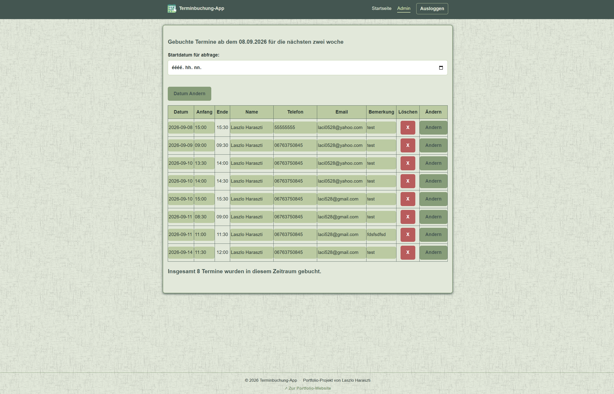
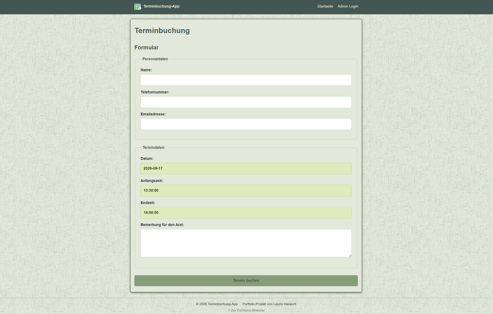
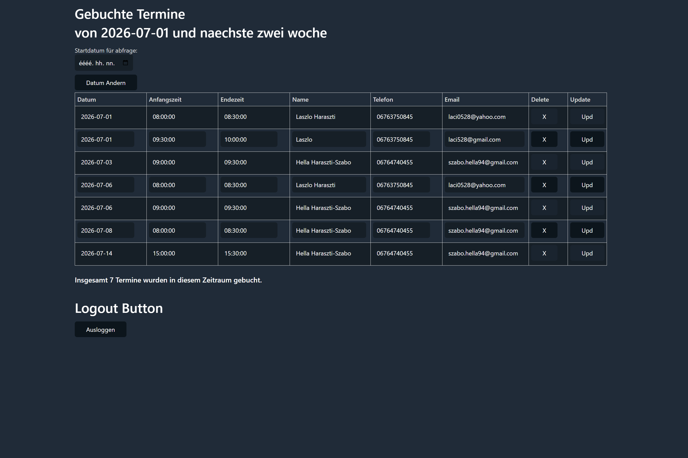

# Appointment Booking App

**This README is available in English and German.**
**Diese README ist auf Englisch und Deutsch verfügbar.**

* [English](#english)
* [Deutsch](#deutsch)

---

## English

### Overview

Appointment Booking App is a small full-stack web application built with PHP and MySQL/MariaDB. Users can select available appointment slots from a calendar, submit booking data through a validated form, while administrators can log in to a protected admin area to view, edit and delete bookings.

The project was created for learning and portfolio purposes. It demonstrates basic backend concepts such as sessions, form handling, validation, prepared statements, transactions, and admin authentication.

### Features

* Calendar-based appointment selection
* Automatic generation of available time slots
* Booking form for customer data
* Server-side validation of appointment data
* Email validation
* Protection against double bookings
* Database transaction during booking
* Success message after successful booking
* Admin login with hashed password verification
* Protected admin area for viewing, editing, and deleting bookings

### Technologies

* PHP
* MySQL / MariaDB
* HTML
* CSS
* Sessions
* Prepared Statements
* Transactions
* XAMPP
* Git / GitHub

### Main Functionality

Users can select available appointment slots from a calendar and submit booking data through a validated form. Administrators can log in to a protected admin area to view, edit, and delete bookings.

After a successful booking, the application redirects back to the main page and displays a confirmation message with the booked date and start time.

The booking process uses prepared statements and a database transaction. If one part of the booking fails, the transaction is rolled back.

### Database

The application uses three main tables:

kunden
gespeicherte_termin
admin_users

To prevent double bookings, the appointment table include a unique constraint:

ALTER TABLE gespeicherte_termin
ADD CONSTRAINT unique_termin UNIQUE (datum, anfang_zeit);

### Installation

1. Clone the repository:

git clone https://github.com/laci528-creator/Termin_booking_app.git

2. Move the project folder into the XAMPP `htdocs` directory.
3. Start Apache and MySQL.
4. Create the database and import database.sql.
5. Copy `includes/config.example.inc.php` to `includes/config.inc.php` 
    and enter your local database credentials.
6. Open the project in the browser:

http://localhost/Termin_booking_app

## Current Status

The application is functional and includes the main features of a simple appointment booking system.

## Planned Improvements

* Add email confirmation
* Add customer cancellation functionality
* Add Docker support
* Add a live demo

## What I Learned

During this project I practiced:

* working with PHP sessions
* building forms with server-side validation
* using prepared statements to prevent SQL injection
* handling database transactions
* protecting an admin area with login authentication
* preventing double bookings with application logic and a database constraint
* structuring a small PHP project into reusable include files

## Screenshots

### Calendar View

### Booking Form

### Admin Area

## Further Documentation

For more details, see:
[Project Documentation](docs/project_documentation.md)

---

## Deutsch

### Überblick

Termin Booking App ist eine kleine Terminbuchungsanwendung mit PHP und MySQL/MariaDB und einem einfachen Adminbereich.

Das Projekt wurde zu Lern- und Portfoliozwecken erstellt. Es zeigt grundlegende Backend-Konzepte wie Sessions, Formularverarbeitung, Validierung, vorbereitete SQL-Abfragen, Datenbanktransaktion und Admin-Authentifizierung.

### Funktionen

* Terminauswahl über einen Kalender
* Automatische Generierung freier Zeitfenster
* Buchungsformular für Kundendaten
* Serverseitige Validierung der Termindaten
* E-Mail-Validierung
* Schutz vor Doppelbuchungen
* Datenbanktransaktion während der Buchung
* Erfolgsmeldung nach erfolgreicher Buchung
* Admin-Login mit Passwort-Hash-Prüfung
* Geschützter Adminbereich zum Anzeigen, Bearbeiten und Löschen von Buchungen

### Technologien

* PHP
* MySQL / MariaDB
* HTML
* CSS
* Sessions
* Prepared Statements
* Datenbanktransaktion
* XAMPP
* Git / GitHub

### Hauptfunktionalität

Benutzer können im Kalender ein Datum auswählen, einen freien Termin anklicken und das Buchungsformular ausfüllen.

Nach erfolgreicher Buchung wird der Benutzer zur Startseite weitergeleitet und erhält eine Bestätigung mit Datum und Startzeit des Termins.

Der Buchungsvorgang verwendet Prepared Statements und eine Datenbanktransaktion. Falls ein Teil der Buchung fehlschlägt, wird die Transaktion zurückgerollt.

### Datenbank

Die Anwendung verwendet drei Haupttabellen:

kunden
gespeicherte_termin
admin_users

Um Doppelbuchungen zu verhindern, die Termintabelle eine Unique Constraint enthalten:

ALTER TABLE gespeicherte_termin
ADD CONSTRAINT unique_termin UNIQUE (datum, anfang_zeit);

### Installation

1. Repository klonen:

git clone https://github.com/laci528-creator/Termin_booking_app.git

2. Projektordner in den XAMPP-Ordner `htdocs` verschieben.
3. Apache und MySQL starten.
4. Datenbank erstellen und database.sql importieren.
5. Kopieren Sie `includes/config.example.inc.php` nach `includes/config.inc.php`
    und geben Sie Ihre lokalen Datenbankzugangsdaten ein.
6. Projekt im Browser öffnen:

http://localhost/Termin_booking_app

## Aktueller Stand

Die Anwendung ist funktionsfähig und enthält die wichtigsten Funktionen eines einfachen Terminbuchungssystems.

## Geplante Verbesserungen

* E-Mail-Bestätigung hinzufügen
* Stornierungsfunktion für Kunden hinzufügen
* Docker-Unterstützung hinzufügen
* Live-Demo hinzufügen

## Was ich gelernt habe

Während dieses Projekts habe ich Folgendes geübt:

* Arbeiten mit PHP-Sessions
* Erstellen von Formularen mit serverseitiger Validierung
* Verwendung von Prepared Statements zur Vermeidung von SQL-Injection
* Umgang mit Datenbanktransaktionen
* Schutz eines Adminbereichs durch Login-Authentifizierung
* Vermeidung von Doppelbuchungen durch Programmlogik und eine Datenbank-Constraint
* Strukturierung eines kleinen PHP-Projekts in wiederverwendbare Include-Dateien

## Screenshots

### Kalenderansicht

### Buchungsformular

### Adminbereich

## Weitere Dokumentation

Weitere Details befinden sich hier:

[Projektdokumentation](docs/project_documentation.md)